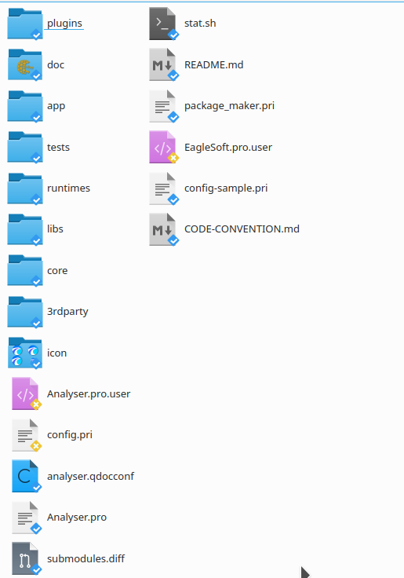
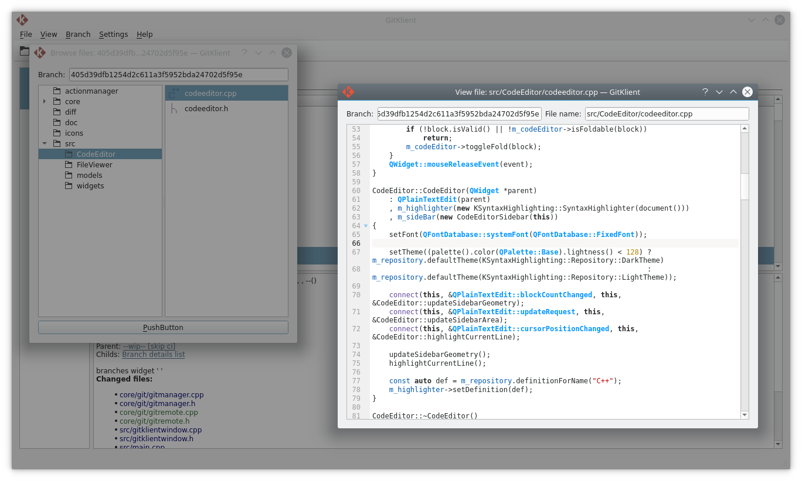
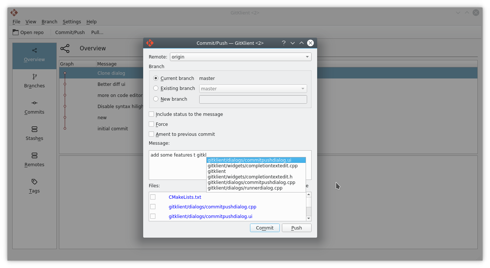
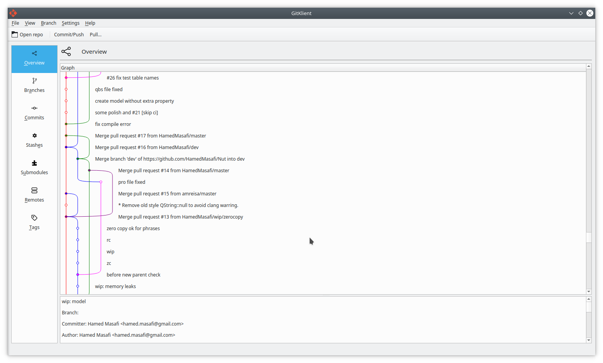
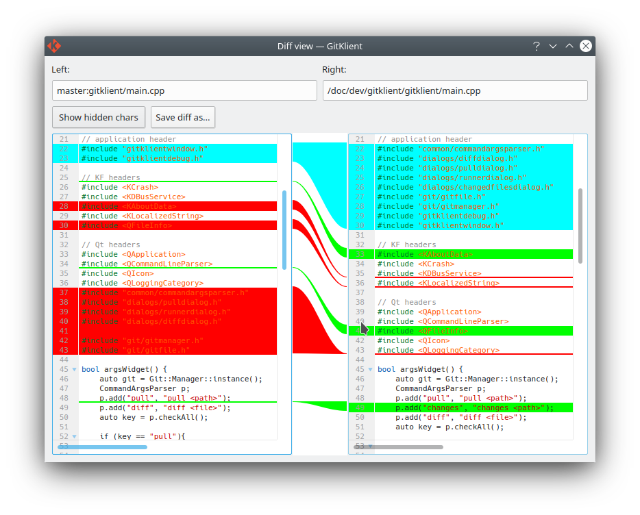
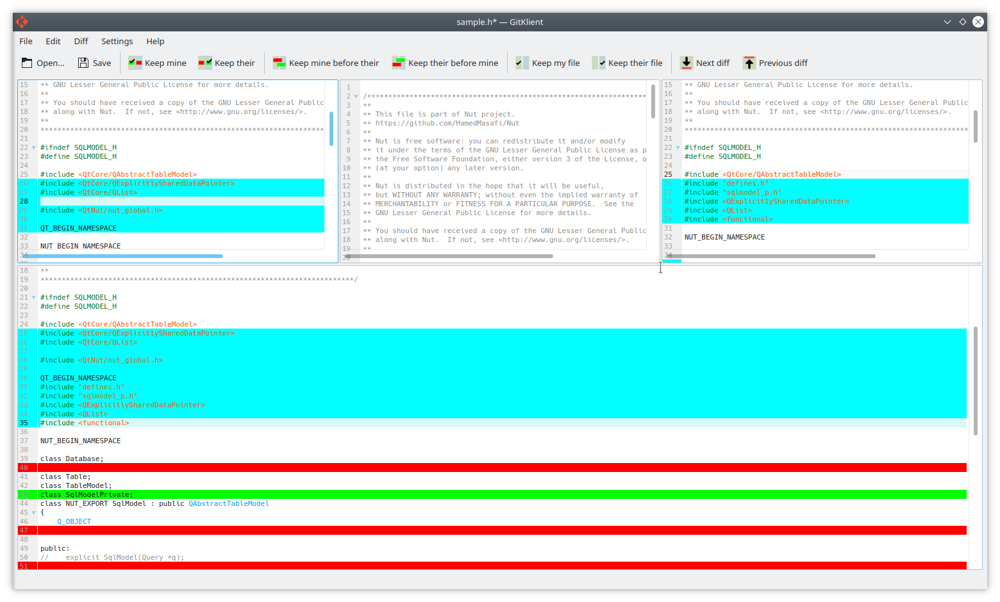

# GitKlient

[](https://github.com/HamedMasafi/GitKlient/actions/workflows/main.yml)
[](https://gitlicense.com/license/hamedmasafi/gitklient)
[](https://www.codacy.com/gh/HamedMasafi/GitKlient/dashboard?utm_source=github.com&amp;utm_medium=referral&amp;utm_content=HamedMasafi/GitKlient&amp;utm_campaign=Badge_Grade)

Git gui client for KDE

## Features

- Show overlay icons on files in the Dolphin file manager
<br />


- Browse files in another branch or commit and view files content 
<br />


- Autocomplete on writing commit messages
<br />


- Graph view for commits and merges
<br />


- Show changes on visual way
<br />


- See differences and conflicts and resolve them by visual tool
<br />



## Build
```
cd <path/to/paoject/source>
mkdir build
cd build
cmake ..
make
sudo make install
```
